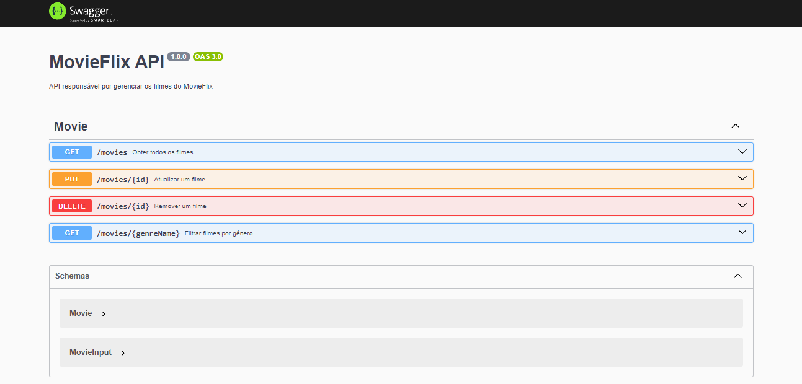
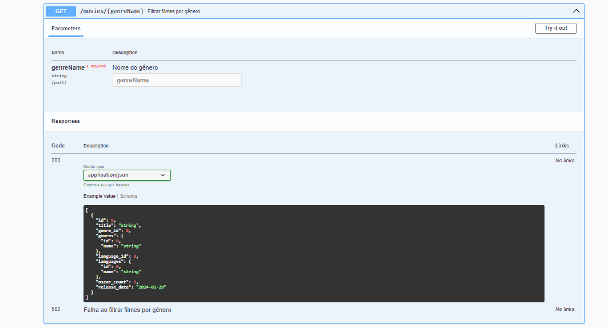
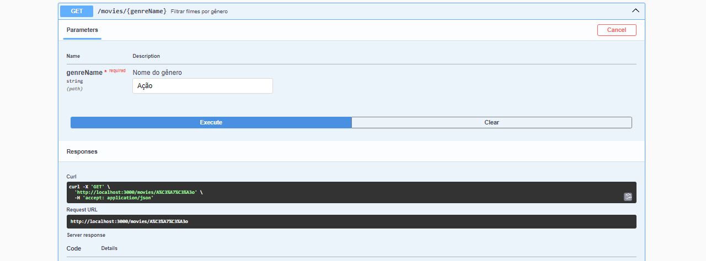
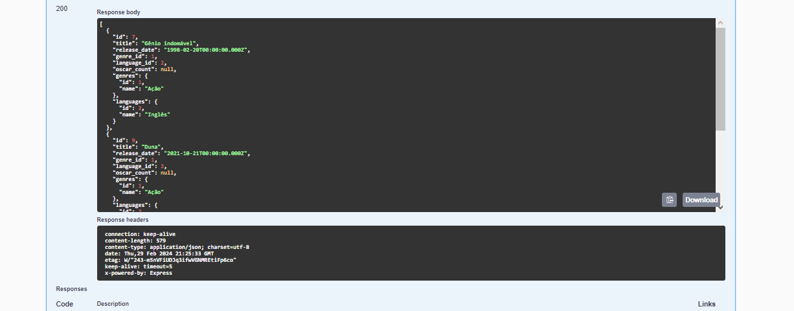

# MovieFlix API
Essa é uma API de filmes, desenvolvido utilizando TypeScript. A API é toda documentada com o swagger, onde consegue, fazer uma busca e obter todos os filmes, fazer consultas dos filmes por gêneros, atualizar/editar dados de um filme e remover um filme. 🚀

 

## Imagens do projeto 🎬

 

## 1 - Visualização da tela inicial do projeto no desktop

 

## 2 - Visualização da tela de filtrar filmes por gênero

 

## 3 - Visualização da tela de filtrar filmes por gênero, passando como parâmetro o gênero "Ação"

 

## 4 - Visualização da busca no exemplo pelo gênero "Ação"

 

## 5 - Visualização da tela inicial do projeto no celular

  

## Tecnologias utilizadas 💻
- TypeScript
- Prisma
- Swagger
- PostgreSQL

 
